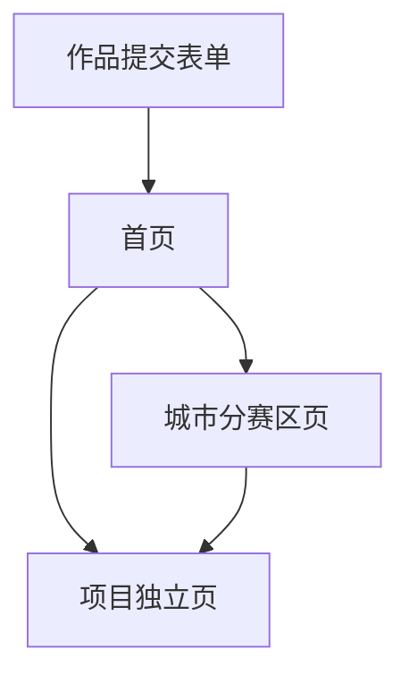

## 1. 产品概述
比赛作品展示平台是一个用于收集和展示参赛项目的系统。通过结构化的数据收集和统一的展示方式，帮助比赛主办方高效管理参赛作品，同时为观众提供清晰的项目浏览体验。

平台主要解决比赛作品收集混乱、展示不统一的问题，为参赛者和观众提供专业的作品展示服务。

## 2. 核心功能

### 2.1 用户角色
| 角色 | 注册方式 | 核心权限 |
|------|----------|----------|
| 参赛者 | 无需注册，直接填写表单 | 提交作品信息 |
| 访客 | 无需登录 | 浏览作品、筛选城市、分享项目 |

### 2.2 功能模块
平台包含两个核心模块：

**提交端（作品收集）**
1. **作品提交表单**：包含项目基础信息、内容描述、外部链接等字段
2. **图片上传功能**：支持项目封面图上传（16:9比例）
3. **数据导出**：支持将收集的作品数据导出为JSON文件

**展示端（静态展示网站）**
1. **首页**：展示活动Banner、项目卡片列表、城市筛选功能
2. **城市分赛区页面**：展示特定城市的所有作品
3. **项目独立页**：完整展示单个项目的详细信息，支持分享

### 2.3 页面详情
| 页面名称 | 模块名称 | 功能描述 |
|-----------|-------------|-------------|
| 作品提交表单 | 基础信息填写 | 输入项目名称、一句话简介、选择所属城市、填写团队成员信息 |
| 作品提交表单 | 项目内容填写 | 编辑解决的问题描述、实现方案（支持富文本） |
| 作品提交表单 | 外部链接填写 | 输入Demo链接（必填）、代码仓库链接（选填） |
| 作品提交表单 | 封面图上传 | 上传16:9比例的项目封面图 |
| 作品提交表单 | 表单提交 | 验证所有必填字段，生成唯一项目ID，保存数据 |
| 首页 | 顶部Banner区域 | 显示活动主视觉、活动名称、活动简介 |
| 首页 | 项目展示区 | 卡片流布局展示所有项目，包含封面图、项目名称、简介、团队、城市信息 |
| 首页 | 筛选功能 | 按城市筛选项目、按"城市优选"筛选 |
| 城市分赛区页 | 城市信息展示 | 显示城市名称、城市简介 |
| 城市分赛区页 | 项目列表 | 展示该城市所有项目，优先显示"城市优选"作品 |
| 项目独立页 | 顶部信息区 | 展示项目封面图、名称、简介、团队、城市、优选标签 |
| 项目独立页 | 项目详情区 | 分块展示解决的问题和实现方案 |
| 项目独立页 | 外部链接区 | 提供Demo按钮和代码仓库按钮（新页面打开） |
| 项目独立页 | 分享功能 | 生成独立URL，支持一键复制链接 |

## 3. 核心流程

### 作品提交流程
1. 参赛者访问提交表单页面
2. 填写项目基础信息（名称、简介、城市、团队）
3. 上传项目封面图
4. 编辑项目内容（问题描述、解决方案）
5. 填写外部链接（Demo必填，代码仓库选填）
6. 提交表单，系统生成唯一项目ID
7. 数据保存并可用于导出

### 访客浏览流程
1. 访客访问首页，查看活动Banner和项目列表
2. 可通过城市筛选查看特定城市作品
3. 点击项目卡片进入项目独立页
4. 在项目独立页查看完整信息
5. 可点击Demo链接体验项目
6. 可复制项目链接进行分享

### 页面导航流程

## 4. 用户界面设计

### 4.1 设计风格
- **主色调**：科技蓝（#0066FF）搭配白色背景
- **辅助色**：深灰色（#333333）用于文字，浅灰色（#F5F5F5）用于背景
- **按钮样式**：圆角矩形，主要按钮使用主色调，次要按钮使用边框样式
- **字体**：系统默认字体，标题18-24px，正文14-16px
- **布局风格**：卡片式布局，清晰的信息层级
- **图标风格**：简约线性图标，突出功能性

### 4.2 页面设计概述
| 页面名称 | 模块名称 | UI元素 |
|-----------|-------------|-------------|
| 首页 | Banner区域 | 全宽Banner图，居中显示活动名称和简介，科技风格渐变背景 |
| 首页 | 项目卡片 | 圆角卡片设计，封面图占满宽度，下方显示项目信息，悬停有阴影效果 |
| 首页 | 筛选器 | 下拉选择框样式，位于项目列表上方，简洁设计 |
| 城市分赛区页 | 城市标题 | 大字号标题，下方显示城市简介文字 |
| 项目独立页 | 顶部信息 | 全宽封面图，下方项目信息采用左右布局，左侧文字右侧标签 |
| 项目独立页 | 内容区域 | 白色卡片背景，清晰的分块标题，富文本内容区域 |
| 项目独立页 | 链接按钮 | 醒目的主要按钮（Demo），次要的边框按钮（代码仓库） |

### 4.3 响应式设计
- 采用桌面优先设计，适配移动端浏览
- 桌面端：1200px容器宽度，多列卡片布局
- 平板端：768px断点，调整为双列布局
- 手机端：375px断点，单列布局，触摸友好的按钮尺寸
- 图片自适应，文字大小根据屏幕尺寸调整

### 4.4 技术实现要求
- 前端框架：Next.js + React
- 样式方案：Tailwind CSS
- 部署平台：支持Vercel、Cloudflare Pages
- 数据源：JSON文件格式
- 图片处理：自动压缩和格式优化